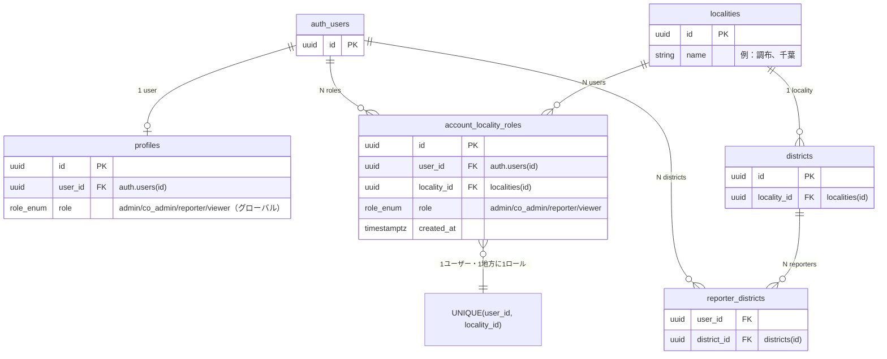

# 仕様書：アカウントの地方別アクセス権限

**作成日:** 2026/02/05  
**対象:** アカウントに対して「アクセスできる地方」を、地方ごとに権限（管理者／共同管理者／報告者／閲覧者）を付与する機能。

**実装バージョン:** 本仕様の「地方別アクセス権限」の中核は **v0.18** で実装済み（`user_localities` ＋ `local_roles` で同等機能）。「デフォルト表示地方」（`profiles.locality_id`）は **v0.21.0**（未定）で追加。実装では `account_locality_roles` ではなく `user_localities`／`local_roles`／`global_role` を採用している。

---

## 1. 目的・概要

* **目的:** 1アカウントで複数地方にアクセスさせ、地方ごとに異なる権限（例：調布＝管理者、千葉＝閲覧者）を付与する。
* **登録イメージ:** 「地方, 権限」のペアを複数持つ。例：調布→管理者、千葉→閲覧者。
* **方針:** 配列（JSONB 等）ではなく、**正規化したテーブル＋外部キー**で保持する（参照整合性・検索・RLS のため）。

---

## 2. リレーション図

**図の凡例:**
- **profiles.role** … グローバル権限（admin/co_admin なら全地方アクセス可能）
- **account_locality_roles** … 地方ごとの権限（user × locality で1行、role を保持）
- **reporter_districts** … 既存。報告者の「担当可能な地区」（案Aではそのまま併用）

---

## 3. 用語・既存スキーマとの対応

| 用語     | DB 上の対応              | 備考 |
|----------|---------------------------|------|
| 地方     | `localities`（地方）      | 例：調布、千葉 |
| 地区     | `districts`（地区）       | 地方に属する。例：調布地区、稲城地区 |
| 権限     | `role_enum`               | admin / co_admin / reporter / viewer |
| アカウント | `auth.users` + `profiles` | 既存 |

**権限の単位:** 本仕様では「地方（locality）単位」で権限を付与する形を基本とする。より細かく「地区（district）単位」にしたい場合は、同一設計で `district_id` を用いたテーブルに読み替える。

---

## 4. データベース設計（推奨）

### 4.1 新規テーブル：アカウント × 地方 × 権限

**テーブル名（案）:** `account_locality_roles`

| カラム        | 型         | 制約 |
|---------------|------------|------|
| `id`          | UUID       | PK, DEFAULT uuid_generate_v4() |
| `user_id`     | UUID       | NOT NULL, FK → auth.users(id) ON DELETE CASCADE |
| `locality_id` | UUID       | NOT NULL, FK → localities(id) ON DELETE CASCADE |
| `role`        | role_enum  | NOT NULL（admin / co_admin / reporter / viewer） |
| （任意）      | created_at | TIMESTAMPTZ DEFAULT now() |

**一意制約:** `UNIQUE(user_id, locality_id)` — 1ユーザー・1地方につき1ロール。

**インデックス:**  
* `idx_account_locality_roles_user_id ON account_locality_roles(user_id)`  
* （必要なら）`idx_account_locality_roles_locality_id ON account_locality_roles(locality_id)`

**採用理由:**
* 地方名を文字列で持たないため、`localities` の改名・ID 変更に対応できる。
* 「このユーザーがこの地方で持つ権限」を 1 行で表現でき、RLS やアプリの条件で使いやすい。
* 配列（JSONB）にしないことで、参照整合性・ typo の混入を防げる。

### 4.2 既存テーブルとの関係

* **`profiles`:** 従来どおり `role`（グローバル）を保持。**admin / co_admin は従来どおり「全範囲アクセス」**とする。
* **`reporter_districts`:** 現状は「担当可能な地区」のみで、地区ごとの権限は持っていない。  
  * **案A:** 本機能を「地方単位」で導入する場合は、`account_locality_roles` のみ追加し、`reporter_districts` は当面そのまま（報告者用の「担当地区」リストとして併用）。  
  * **案B:** 権限を「地区単位」にしたい場合は、`reporter_districts` に `role role_enum` を追加し、`(user_id, district_id, role)` で管理する形に拡張する。

本仕様では **案A（地方単位の新規テーブル）** を推奨とする。

---

## 5. 権限判定の考え方

### 5.1 グローバルロール（従来どおり）

* **admin / co_admin:** `profiles.role` が admin または co_admin のユーザーは、**全地方・全データ**にアクセス可能。`account_locality_roles` は参照しない。
* 判定: `get_my_role() IN ('admin', 'co_admin')` なら全許可。

### 5.2 地方別ロール（新規）

* **reporter / viewer（または admin / co_admin を地方限定で付与する場合）:**  
  `profiles.role` が admin/co_admin でない、または「地方限定で権限を付与する」運用にする場合は、**対象レコードの地方**に応じて `account_locality_roles` を参照する。
* 判定例:  
  * ある `locality_id` に対して「このユーザーがその地方で報告者以上か」を調べる関数を用意する（例: `get_my_role_for_locality(locality_id)`）。  
  * 集会・メンバー・出席など、地方（または地区→地方）に紐づくデータへのアクセス時は、「そのデータの地方について、ユーザーが要求ロール以上か」を上記で判定する。

### 5.3 運用ポリシー（推奨）

* **管理者・共同管理者:** 従来どおり `profiles.role` のみで判定し、全範囲アクセス。  
* **報告者・閲覧者:**  
  * 従来どおり `profiles.role` が reporter/viewer のまま「グローバルに」付与する運用も可能。  
  * 「地方ごとに」制限する場合は、`profiles.role` は viewer（または専用ロール）とし、**実際にどこで何ができるか**は `account_locality_roles` で決める。

---

## 6. RLS・アプリケーションへの影響

* **RLS:** 現在は多くのポリシーが `get_my_role()` のみで判定している。地方別権限を反映するには、  
  * 対象テーブルが「どの地方に属するか」（例: `district_id` → `districts.locality_id`）を判別できるようにし、  
  * 「`get_my_role()` が admin/co_admin なら許可」「そうでなければ `get_my_role_for_locality(該当 locality_id)` が要求ロール以上なら許可」といった条件に変更する必要がある。  
* **段階導入:** まずはアプリ側で「アクセス可能な地方一覧」「地方ごとの権限」を `account_locality_roles` から取得し、画面・API の出し分けに利用し、RLS は後から厳しくする、という順序も可能。

---

## 7. 登録・表示のイメージ

* **登録:** 1アカウントにつき、複数行を登録する。  
  * 例: user_id = U1 に対して、(U1, 調布の locality_id, admin)、(U1, 千葉の locality_id, viewer) を挿入。  
* **表示:** 「調布, 管理者」「千葉, 閲覧者」のように、地方名（`localities.name`）と権限ラベルを一覧表示。  
* **UI:** 地方は `localities` から選択（ドロップダウン等）、権限は role_enum から選択。行の追加・削除・編集で「地方, 権限」のペアを管理する。

---

## 8. まとめ・不採用にすべきやり方

| やり方 | 問題点 |
|--------|--------|
| 地方名＋権限を JSONB 配列で保持 | 参照整合性なし・表記ゆれ・検索・RLS が書きづらい |
| 地方名を文字列で持つ | 改名・typo でデータが壊れやすい |
| 正規化テーブルで `locality_id` + `role` を保持 | 参照整合性・検索・RLS と相性が良い（推奨） |

**本仕様書では、「アカウント × 地方 × 権限」を正規化テーブル（`account_locality_roles`）で持つ方式を推奨する。**

---

## 9. 今後の作業メモ（実装時参照）

* マイグレーション: `account_locality_roles` テーブル・インデックス・RLS ポリシー・`get_my_role_for_locality(locality_id)` の追加。
* `profiles` の `handle_new_user` は従来どおりでよい。必要なら「地方限定ユーザー」用に `account_locality_roles` のみ挿入する運用にする。
* 型定義: `src/types/database.ts` に `AccountLocalityRole` 等を追加。
* 設定画面: ユーザー管理などで「アクセスできる地方」を一覧・追加・削除・権限変更できる UI を用意する。
