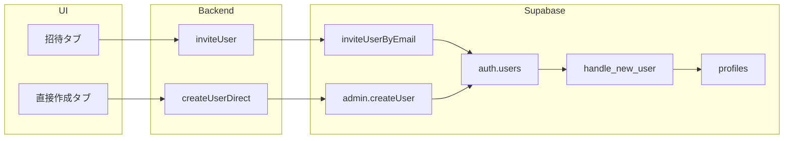

# v0.21.0: 設定/ユーザー・ロール管理の機能強化（直接作成）

## 現状

- **招待のみ**: [src/app/(dashboard)/settings/roles/actions.ts](src/app/(dashboard)/settings/roles/actions.ts) の `inviteUser()` は `inviteUserByEmail()` を使い、招待メールを送り、ユーザーがリンクから登録する。
- **profiles**: [supabase/migrations/001_initial_schema.sql](supabase/migrations/001_initial_schema.sql) の `handle_new_user` トリガーが `auth.users` 挿入時に `profiles` を自動作成し、`full_name` は `raw_user_meta_data->>'full_name'` または `->>'name'` から取得している。
- **UI**: [src/app/(dashboard)/settings/roles/RoleManagementClient.tsx](src/app/(dashboard)/settings/roles/RoleManagementClient.tsx) の「招待（新規ユーザー）」ではメールアドレス入力のみ。

## 実装方針

- **「直接作成」**: メール・パスワード・氏名（full_name）を入力し、Supabase Admin API の `createUser()` で **Auth に** ユーザーを作成する（DB の `auth.users` は API 経由でのみ操作可能）。トリガーにより `profiles` が自動作成され、`user_metadata.full_name` が `profiles.full_name` に反映される。
- **招待はそのまま**: 既存の「招待」は残し、UI で「招待（メール送信）」と「直接作成」を切り替え可能にする。

## 変更箇所

### 1. Server Action: 直接作成 API

**ファイル**: [src/app/(dashboard)/settings/roles/actions.ts](src/app/(dashboard)/settings/roles/actions.ts)

- **新規**: `createUserDirect(email, password, fullName?, options?)` を追加。
  - `ensureGlobalAdmin()` で global admin のみ許可（既存 `inviteUser` と同様）。
  - `createAdminClient().auth.admin.createUser({ email, password, email_confirm: true, user_metadata: fullName ? { full_name: fullName } : {} })` を呼ぶ。
  - 作成されたユーザー ID に対して、既存の `inviteUser` と同様に `profiles` の `global_role` 更新、`user_areas` / `user_localities` / `local_roles` の挿入を行う（options で指定された場合）。
  - 戻り値は `InviteResult` と同様の型（`{ ok: true, message } | { ok: false, error }`）。
- バリデーション: `email` 必須、`password` は Supabase の最小長に合わせてチェック（例: 6 文字以上）。`fullName` は任意（空なら null で profiles に保存される）。

### 2. UI: 招待ブロックの拡張

**ファイル**: [src/app/(dashboard)/settings/roles/RoleManagementClient.tsx](src/app/(dashboard)/settings/roles/RoleManagementClient.tsx)

- 「招待（新規ユーザー）」セクションを **タブまたはトグル** で「招待（メール送信）」と「直接作成」に分ける。
- **直接作成** 時:
  - 入力欄: メールアドレス（必須）、パスワード（必須）、氏名（任意・`profiles.full_name` 用）。
  - オプション: 既存の招待と同様に、作成直後にグローバル権限・地域・地方・ローカル権限を設定したい場合は、同じ options を渡せるようにする（v0.21.0 ではシンプルに「作成」のみでも可。必要なら「作成してからロールを編集」で既存のユーザー選択に飛ばす）。
  - 送信で `createUserDirect(email, password, fullName, options)` を呼び、成功時はメッセージ表示・フォームクリア・一覧の再取得（revalidate で対応済みの想定）。
- パスワードは `type="password"` とし、注意書きで「本番では HTTPS で送信されます」程度の表示を検討。

### 3. 既存 profiles の full_name 更新について

- **新規作成時**: `createUser` の `user_metadata: { full_name }` により、トリガーで `profiles.full_name` が設定される。追加の DB 更新は不要。
- **既存ユーザーの full_name 編集**: 今回の要件は「メール・パスワード・full_name を指定して**直接 DB に書き込み**」であり、新規作成時の full_name 指定で足りる。既存ユーザーの氏名変更は、現状どおり profiles の UPDATE（global admin で可能なら）や、別チケットで対応する想定とする。必要であれば、ユーザー選択時の編集フォームに「氏名」欄を追加するかは別計画とする。

### 4. バージョン・リリースノート・バッジ

- **バージョン**: 0.21.0 に統一。
- [src/components/Nav.tsx](src/components/Nav.tsx): バッジ表記を `0.20.2` → `0.21.0` に変更（2 箇所）。
- [RELEASE_NOTES.md](RELEASE_NOTES.md): v0.21.0 の見出しと項目を追加。
- `_RealeaseNotes/0.21.0.md`: 新規作成。内容は「設定/ユーザー・ロール管理の機能強化：メール・パスワード・氏名を指定してユーザーを直接作成できるようにした」など。

## 注意・確認

- **SUPABASE_SERVICE_ROLE_KEY**: 既存の招待と同様、直接作成も Admin API を使うため必須。未設定時は `createUserDirect` でエラーメッセージを返す。
- **パスワード**: クライアント → Server Action で送るため、本番は HTTPS 必須。パスワードはサーバーでログに残さない。
- **RLS**: `profiles` の INSERT はトリガー（SECURITY DEFINER）が行うため、Admin API で作成したユーザーも問題なく 1 行ができる。その後の `profiles` UPDATE / `user_areas` 等は既存の `createClient()` と RLS（global admin 許可）で行う。

## 実装後の確認

- 設定 > ユーザー・ロール管理で「直接作成」からメール・パスワード・氏名を入力して作成できること。
- 作成後、一覧にそのユーザーが表示され、`full_name` が指定した値になっていること。
- 招待フローは従来どおり動作すること。
- global admin 以外は招待・直接作成ともに利用できないこと。
