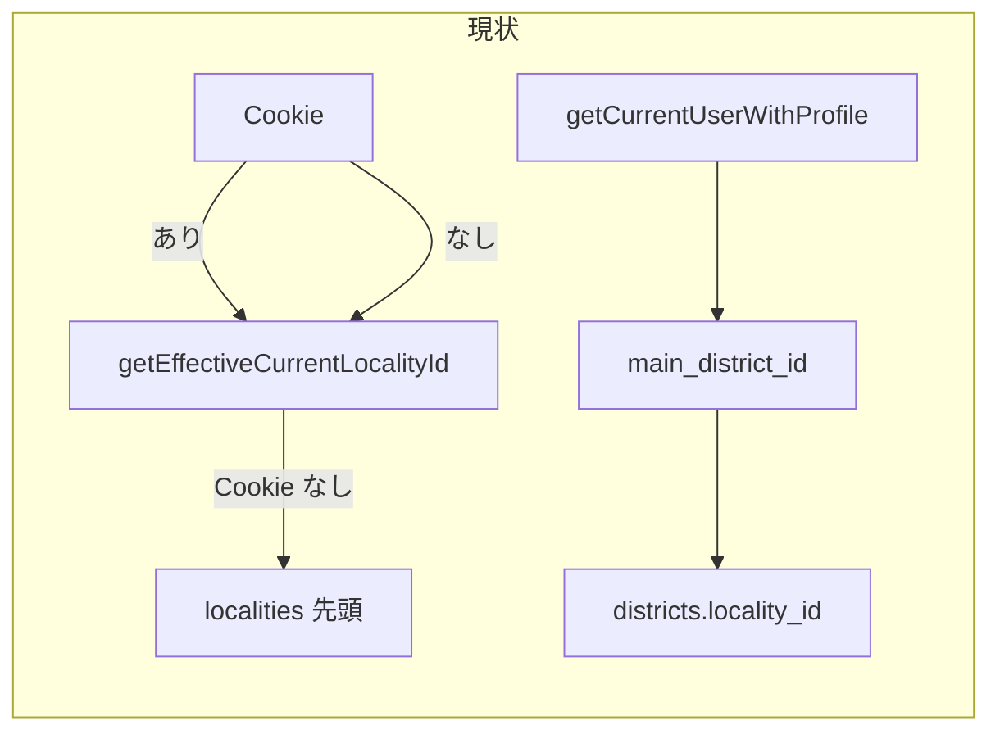
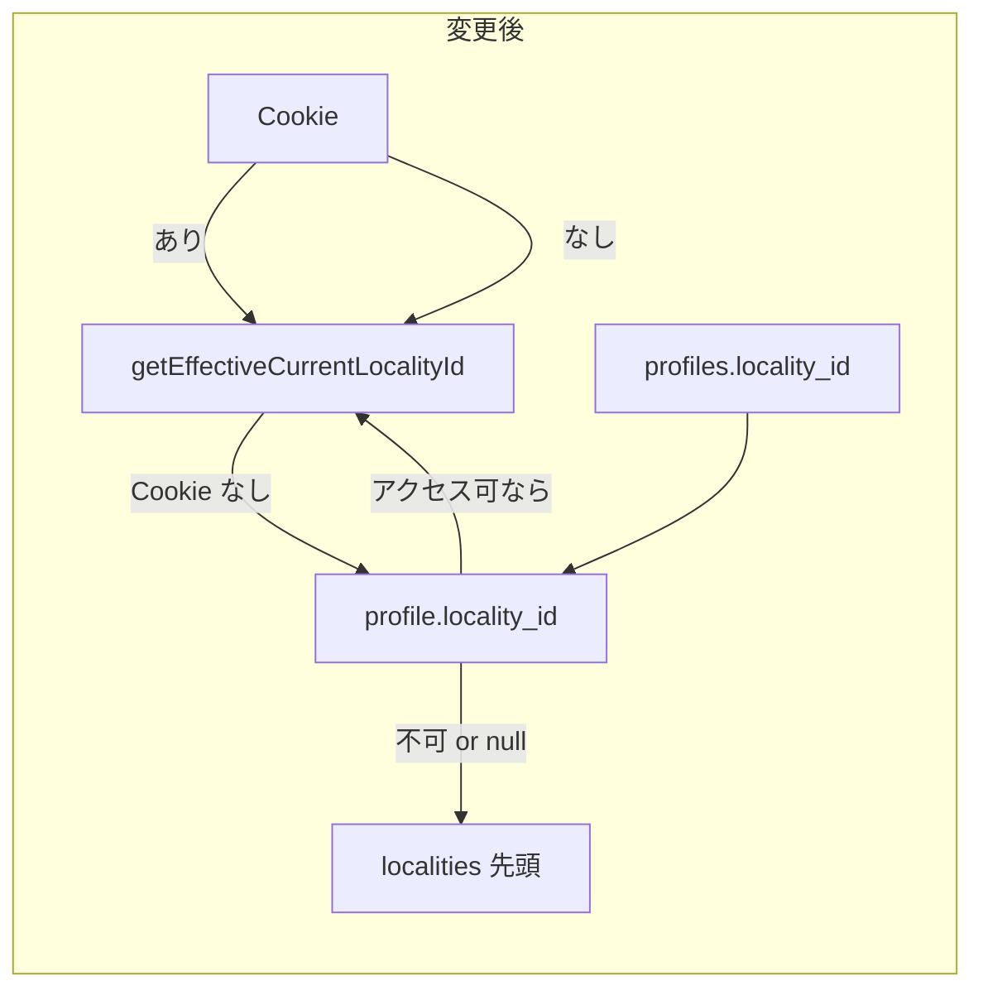

# profiles.locality_id 追加とデフォルト表示地方の仕様

## 目的

- **profiles に `locality_id` を追加**し、現在「main_district_id → districts.locality_id」で取っている「所属地方」を profile で直接持つ。
- **サイトを開いたときのデフォルト表示地方**を、Cookie が未設定のときに **profile.locality_id** とする（グローバル権限ユーザーも同じ）。

## 現状の流れ（変更前）

- デフォルト地方: Cookie → なければ **常に `localities[0].id`**（アクセス可能な地方の先頭）。profile は未使用。
- 所属表示: `profiles.main_district_id` → `districts` JOIN → `locality_id` / `localities(name)`。

## 変更後の流れ

- デフォルト地方: Cookie → なければ **profile.locality_id がアクセス可能一覧に含まれるならそれ** → それ以外（不可 or null）は従来どおり `localities[0].id`。
- 所属・デフォルト地方名: `profiles.locality_id` を SELECT し、必要なら `localities(name)` で JOIN。

---

## 1. DB 変更（migration）

**新規ファイル**: `supabase/migrations/033_profiles_locality_id.sql`

- `profiles` に `locality_id UUID REFERENCES localities(id) ON DELETE SET NULL` を追加（既存は 001 で id, email, role, full_name, main_district_id のみ）。
- 既存データ: `main_district_id` から `districts.locality_id` を取得して `profiles.locality_id` を一括 UPDATE。  
  `UPDATE profiles SET locality_id = (SELECT locality_id FROM districts WHERE id = profiles.main_district_id) WHERE main_district_id IS NOT NULL;`
- 新規ユーザー: `handle_new_user` は変更しない（locality_id は NULL のまま。招待/直接作成時に options で設定する想定）。

**RLS**: 既存の `profiles_update_own` / `profiles_update_global_admin` で `locality_id` の UPDATE も許可されるため、追加ポリシー不要。

---

## 2. 型・データ取得の変更

### 2.1 型定義

- [src/types/database.ts](src/types/database.ts): `Profile` に `locality_id: string | null` を追加。
- [src/lib/cachedData.ts](src/lib/cachedData.ts): `CurrentUserWithProfile.profile` に `locality_id: string | null` を追加。  
  `ProfileWithDistrictLocality` および `getCurrentUserWithProfile` の返却 `profile` に `locality_id` を含める。

### 2.2 getCurrentUserWithProfile

- **SELECT**: `profiles` の select に `locality_id` を追加。  
  従来の `districts!main_district_id(locality_id, localities(name))` は、**localityName 用**に「profile.locality_id の名前」を返すようにする。  
  - 方法: `locality_id` と `localities(name)` を FK 経由で JOIN。  
  - または: `locality_id` だけ取得し、`localityName` は `getCachedLocalities()` の結果から `locality_id` で引く。
- **localityName の意味**: 「デフォルト表示地方の名前」= profile.locality_id の名前とする。  
  - フォールバック: locality_id が null のときは従来どおり `row?.districts?.localities?.name`（main_district の地方名）を使う。

### 2.3 getEffectiveCurrentLocalityId

- **変更**: Cookie が null のとき、**getCurrentUserWithProfile で profile を取得**し、`profile?.locality_id` が `getCachedLocalities()` の id 一覧に含まれるなら `profile.locality_id` を返す。含まれない、または profile.locality_id が null なら従来どおり `localities[0]?.id ?? null`。
- **注意**: getCachedLocalities は RLS でアクセス可能な地方のみ返すため、「profile.locality_id が一覧に含まれる」= そのユーザーがその地方にアクセス可能であることを保証できる。

### 2.4 Dashboard layout（初回表示時の Cookie 設定）

- **変更**: Cookie が未設定のとき、**profile.locality_id がアクセス可能**（localities の id に含まれる）なら `effectiveLocalityId = profile.locality_id` とし、必要ならその値を Cookie に set する。単一地方のときの自動 set は現状どおり。profile は既に data にあるので、data.profile.locality_id が localities に含まれるかで分岐。

---

## 3. 表示・一覧で district 経由をやめる箇所

### 3.1 設定 > ユーザー・ロール管理（roles）

- **変更**: select に `locality_id` を追加し、`localities(name)` を profile の locality_id で JOIN。「所属」表示は `row.localities?.name ?? row.districts?.localities?.name` のように locality_id の名前を優先。

### 3.2 ユーザー・ロール管理フォーム: デフォルト表示地方の編集

- **新規**: ユーザー選択時の編集エリアに「デフォルト表示地方」を追加。選択肢はそのユーザーがアクセス可能な localities に限定。保存は `updateProfileLocalityId(userId, localityId | null)`。global admin のみ。

### 3.3 招待・直接作成時の locality_id

- **inviteUser / createUserDirect**: options に `defaultLocalityId?: string | null` を追加。作成後に profiles を更新する処理で `locality_id: options.defaultLocalityId ?? null` を SET。
- **UI**: 招待フォーム・直接作成フォームの両方に「デフォルト表示地方」の選択肢を追加し、アカウント作成時に locality を選べるようにする。

---

## 4. main_district_id をそのまま使う箇所（変更なし）

- 集会系の defaultDistrictId（その地方内のデフォルト地区）は `profile.main_district_id` のまま。getMeetingsLayoutData 内の reporter_districts / main_district_id も変更不要。

---

## 5. 影響箇所チェックリスト（バグ・エラー防止）

| 箇所 | 変更内容 | リスク |
|------|----------|--------|
| migration 033 | profiles に locality_id 追加・既存は main_district から埋める | 既存 main_district_id が無効な場合、locality_id は NULL のまま。許容。 |
| getEffectiveCurrentLocalityId | Cookie なし時に profile.locality_id を参照 | profile が null / locality_id が null またはアクセス不可のときは localities[0] にフォールバック。必須。 |
| layout effectiveLocalityId | Cookie なし時に profile.locality_id を採用 | profile は認証済みなので存在。locality_id が localities に含まれるかだけチェック。 |
| getCurrentUserWithProfile | profile に locality_id、localityName を locality_id 由来に | locality_id が null のとき localityName は main_district の地方名でフォールバック。 |
| roles/page.tsx | profiles の select に locality_id と localities(name)、main_locality_name の算出を locality 優先に | JOIN の取り方だけ注意。 |
| UserRoleForm | デフォルト表示地方の select + updateProfileLocalityId | アクセス可能な地方だけ選択肢に出す。保存時 RLS で global admin のみ。 |
| inviteUser / createUserDirect | options.defaultLocalityId で profiles.locality_id を設定 | 既存の profiles 更新ブロックに 1 列追加。招待・直接作成の両方の UI で選択可能に。 |
| 地方削除時 | profiles.locality_id は ON DELETE SET NULL | 削除された地方を参照していたユーザーは locality_id が NULL。次回は localities[0] がデフォルト。 |

---

## 6. 実装順序（推奨）

1. **Migration**: 033 で profiles.locality_id 追加と既存データの UPDATE。
2. **型・getCurrentUserWithProfile**: profile に locality_id を追加し、localityName を locality_id ベースに（フォールバック付き）。
3. **getEffectiveCurrentLocalityId**: Cookie なし時に profile.locality_id を考慮。
4. **layout**: effectiveLocalityId 決定に profile.locality_id を反映。
5. **roles/page.tsx**: profiles の select と main_locality_name を locality_id 優先に変更。
6. **updateProfileLocalityId + UserRoleForm**: デフォルト表示地方の編集 UI。
7. **inviteUser / createUserDirect**: defaultLocalityId オプションと profiles.locality_id の初期設定。招待・直接作成の両フォームに「デフォルト表示地方」選択を追加。

---

## 7. テスト・確認項目

- 既存ユーザー（main_district_id あり）: migration 後、profile.locality_id が main_district の地方と一致していること。
- Cookie 未設定でログイン: 初回表示で profile.locality_id の地方が選択されていること（グローバル権限ユーザーも同様）。
- profile.locality_id が null: 従来どおり localities[0] がデフォルトになること。
- ユーザー・ロール管理で「デフォルト表示地方」を変更し保存できること。招待/直接作成で defaultLocalityId を選ぶと profiles.locality_id がセットされること。
- 集会系の「デフォルト地区」は main_district_id のままで、現在の地方に属する地区が正しくデフォルトになること。

---

この内容を v0.21.0 の「設定/ユーザー・ロール管理の機能強化」に含め、直接作成（メール・パスワード・full_name）とあわせてリリースする。
