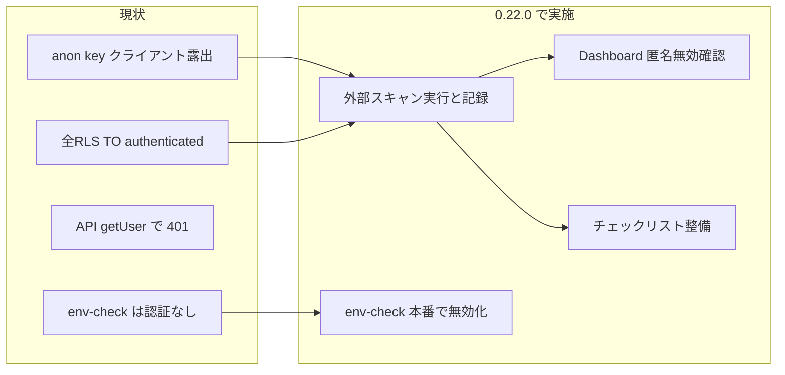

# v0.22.0 Supabase リスク管理プラン

## 参照記事の要点

- 外部スキャンは「HTML/JS から Supabase URL と anon key を検出し、**匿名アクセス**でどこまで操作できるかを外部視点でチェック」する。
- 重要なのはスコアだけでなく「**どのテーブルにどの操作が許可されているか**」。機密カラムを含むテーブルで Read が通る場合は優先見直し。
- 結果は外部から見える範囲に限定され、業務ロジックや権限設計の妥当性まではカバーしない。公開前の最終確認として実装レビューと併用するのが効果的。

---

## 現状分析（コードベースから分かること）

### 1. 接続情報の露出

| 項目               | 現状                                                                                                                                                                                             |
| ---------------- | ---------------------------------------------------------------------------------------------------------------------------------------------------------------------------------------------- |
| anon key の露出     | **あり**。クライアントで [src/lib/supabase/client.ts](src/lib/supabase/client.ts) が `NEXT_PUBLIC_SUPABASE_URL` / `NEXT_PUBLIC_SUPABASE_ANON_KEY` を使用。Next.js の `NEXT_PUBLIC_*` はバンドルに含まれるため、外部スキャンで検出可能。 |
| service role key | サーバー専用（[src/lib/supabase/server.ts](src/lib/supabase/server.ts) の `createAdminClient` のみ）。フロントに露出していない。                                                                                        |

→ 記事の前提「URL/anon key は外部から取得可能」は満たしている。対策は「匿名で何ができるか」をゼロに近づけること。

### 2. RLS（Row Level Security）

- **全テーブルで RLS が有効**。ポリシーはすべて `**TO authenticated`**（ログイン済みユーザー向け）。
- `**TO anon` で許可しているポリシーは存在しない**。したがって、anon key のみで REST API を叩いても、全テーブルで SELECT/INSERT/UPDATE/DELETE は RLS により拒否される想定。
- 地域スコープは `get_my_accessible_locality_ids()` / `can_access_locality()` 等で制御され、認証済みユーザーでもアクセス可能な地方のデータに限定されている。

→ **匿名アクセスではテーブル単位の Read/Write は通らない設計**。ただし「実際にスキャンして確認する」ことが記事の趣旨。

### 3. 認証・API

- ダッシュボード: [src/app/(dashboard)/layout.tsx](src/app/(dashboard)/layout.tsx) で `getCurrentUserWithProfile()` を実行し、`!data.user` なら `redirect("/")`。未認証ではダッシュボードに入れない。
- データを返す API（`/api/members`, `/api/organization`, `/api/organization-lists`, `/api/data-version`, `/api/meetings-list`) はすべて `**supabase.auth.getUser()` で未認証なら 401** を返している。
- **例外**: [src/app/api/env-check/route.ts](src/app/api/env-check/route.ts) は認証なしで GET 可能。中身は `NEXT_PUBLIC_SUPABASE_URL` / `NEXT_PUBLIC_SUPABASE_ANON_KEY` の「set/missing」のみで実値は返さないが、Supabase 利用の有無を外部から確認できる情報開示にはなる。

### 4. Storage・匿名ログイン

- **Storage** は未使用（コード内に `storage.from` 等なし）。
- **匿名ログイン**（`signInAnonymously`）はコード内で使用していない。Supabase ダッシュボードで「Anonymous sign-in」が有効かどうかはコードからは判断できない。

---

## 必要な措置（記事に沿った実施項目）

### 措置 A: 外部スキャンの実行と記録（必須）

- [AIのあとしまつ Supabase 外部スキャン診断](https://www.atoshimatsu.com/tools/supabase-risk-check) に、**自身が管理する本番（またはステージング）URL** を入力してスキャンを実行する。
- 結果をプロジェクト内で記録する（例: `_RealeaseNotes/0.22.0_supabase_risk_scan.md`）。「テーブル単位の Read/Write 可否」「機密情報カラムを含むテーブルで Read が通っていないか」を確認する。
- スキャンで問題が検出された場合は、RLS ポリシーまたはアプリ側の認証・露出箇所を修正し、再スキャンで解消を確認する。

### 措置 B: 本番での診断用 API の無効化（推奨）

- `/api/env-check` は「Vercel で環境変数が読めているか確認する」診断用であり、本番では不要。
- **案 1**: 本番（`NODE_ENV === "production"`）では 404 または 401 を返す。  
- **案 2**: ドキュメント化し、デプロイ確認後にルートを削除する。  
- いずれにしても、本番 URL から「Supabase 利用の有無」を返さないようにする。

### 措置 C: Supabase ダッシュボード設定の確認（必須・手作業）

- **Authentication → Providers**: 「Anonymous」が **無効** であることを確認する。有効だと匿名ユーザーが `authenticated` として扱われ、RLS の `TO authenticated` が適用されてしまう可能性がある。
- （任意）Auth の「Email」以外の不要なプロバイダが無効であることも確認するとよい。

### 措置 D: RLS と「機密テーブル」のチェックリスト整備（推奨）

- 記事の「機密情報カラムを含むテーブルで Read が通る場合は優先的に見直し」に合わせ、プロジェクトで機密とみなすテーブル・カラムを一覧化する。
  - 例: `members`（氏名・ふりがな・洗礼日等）、`profiles`、`audit_logs`、`login_logs` など。
- 現行 RLS ではいずれも `TO authenticated` かつ locality/role スコープで制限されているため、**anon では Read 不可**。このことをチェックリストに明記し、今後のマイグレーション追加時も「anon で Read が開いていないか」を確認する手順をドキュメントに残す。

### 措置 E: 今後の定期確認のルール化（推奨）

- 新規テーブル追加・RLS 変更時には、チェックリストと照らして「anon で Read/Write が許可されていないこと」を確認する。
- 本番デプロイ前や四半期ごとに、外部スキャン（措置 A）を再実行し、結果を簡潔に記録する運用を推奨する。

---

## 実装タスク（コード変更が必要な部分）

- **env-check の本番無効化**  
  - [src/app/api/env-check/route.ts](src/app/api/env-check/route.ts): 本番では `NextResponse.json({ error: "Not Found" }, { status: 404 })` を返す、または認証必須にする。
- **リリースノート・スキャン結果用ドキュメント**  
  - `RELEASE_NOTES.md` に 0.22.0 の Supabase リスク管理対応を追記。  
  - 外部スキャン結果を記録するファイル（例: `_RealeaseNotes/0.22.0_supabase_risk_scan.md`）のひな形を用意し、スキャン実施後に結果を貼り付ける。  
  - （任意）`docs/` に「Supabase リスク確認チェックリスト」を追加し、措置 C・D・E を簡潔に記載する。

---

## まとめフロー

- **コードでできること**: env-check の本番無効化、リリースノート・チェックリスト・スキャン結果用ドキュメントの追加。
- **手作業で行うこと**: 外部スキャンの実行、Supabase ダッシュボードでの Anonymous 無効確認、スキャン結果の記録。

このプランに沿って進めれば、記事の「匿名アクセスでどこまで操作できるかを可視化し、必要な措置を取る」という目的を満たせる。
