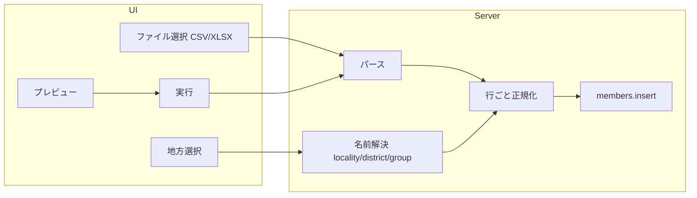

# 管理人名簿インポート機能

## データベースと異なる項目名・値の判別（マッピング）

**はい、判別します。** CSV の項目名や選択肢が DB のフィールド名・enum 値と違っていても、インポート処理で**マッピング層**を設け、変換してから DB に保存します。

- **性別**: CSV「男性」「女性」→ DB `gender`: `male`, `female`
- **身分**: CSV「聖徒」「友人」→ DB `is_baptized`: `true`, `false`
- **年齢層**: CSV「青年」「中年」「年長」「小学生」等（DB にないラベル）→ 既存の `age_group`（category_enum）にマッピング（後述）。**DB の enum は変更せず、コード側のマッピングのみ**
- **状態**: CSV「正常」等 → DB `status`（追加予定）。値も必要なら「正常」→ `active` 等のマッピング

列名についても、「性別」「Last Name」など CSV のヘッダー名と DB のカラム名が一致していなくてよい。実装では「期待する論理列」（氏名・性別・地方・地区・小組・バプテスマ・身分・年齢層・メモ等）を定義し、CSV ヘッダー名または列位置でそれに結びつける。

---

## ご質問への回答

### 1）地区名は DB 上あらかじめ設定しておくべきか

**推奨: はい。** インポート前に「枠組設定」で該当地方の地区・小組を登録しておく運用が安全です。

- **地方（locality）**: 005 で `市川` 等が既に localities に投入済み。なければ管理者が枠組設定で追加可能。
- **地区（district）・小組（group）**: インポート時は「地方名→地区名→小組名」で **名前一致** により `district_id` / `group_id` を解決する。存在しない名前の行は「地区・小組なし」とするか、エラー行として報告するかは仕様で決める。
- 地区・小組をインポートで自動作成する案は、既存の枠組・RLS と整合させる必要があり複雑なため、**まずは「既存の地区・小組マスタに名前でマッピング」** にすると実装が明確です。

### 2）バプテスマの年月日は別々の列に格納した方がよいか

**現状のままで問題ありません。** DB は既に **年・月・日の3列** を持っています。インポート用ファイル（[_Prep/ichikawa_churchStats_migration - to-be-imported.csv](_Prep/ichikawa_churchStats_migration%20-%20to-be-imported.csv)）では **バプ年・バプ月・バプ日** がすでに3列で渡されているため、そのまま `baptism_year` / `baptism_month` / `baptism_day` に流し込む。1列で「バプテスマ年月日」の形式の CSV が来た場合は、パースして year/month/day に振り分ける処理も用意する。

---

## インポート予定ファイルとスキーマの対応

対象: [_Prep/ichikawa_churchStats_migration - to-be-imported.csv](_Prep/ichikawa_churchStats_migration%20-%20to-be-imported.csv)  
ヘッダー: `Last Name, First Name, Last Name Furigana, First Name Furigana, 性別, 地方, 地区, 小組, バプ年, バプ月, バプ日, 身分, 年齢層, メモ`

| CSV列（論理） | ヘッダー例                                   | 内容例            | DB/アプリでの扱い                                                                                                                           |
| -------- | --------------------------------------- | -------------- | ------------------------------------------------------------------------------------------------------------------------------------ |
| 姓・名      | Last Name, First Name                   | 三澤, 由美         | `name` = `${lastName} ${firstName}`.trim()                                                                                           |
| 姓・名ふりがな  | Last Name Furigana, First Name Furigana | ミサワ, ユミ        | `furigana` = 同上                                                                                                                      |
| 性別       | 性別                                      | 男性/女性          | **マッピング**: 男性→`male`, 女性→`female`                                                                                                    |
| 地方・地区・小組 | 地方, 地区, 小組                              | 市川, 市川, 小岩     | locality_id / district_id / group_id を名前で解決                                                                                          |
| バプテスマ    | バプ年, バプ月, バプ日                           | 2023, (空), (空) | そのまま baptism_year/month/day。空は null。                                                                                                 |
| 身分       | 身分                                      | 聖徒/友人          | **マッピング**: 聖徒→`is_baptized` true, 友人→false                                                                                           |
| 年齢層      | 年齢層                                     | 青年, 中年, 年長…    | **マッピング**: 青年/中年/壮年/大人→`adult`, 大学生→`university`, 中高生→`high_school`, 小学生→`elementary`, 就学前/年長→`preschool`（DB の category_enum は変更しない） |
| メモ       | メモ（N列）                                  | 自由文            | **新規** `members.memo`（マイグレーションで追加）                                                                                                   |

※ 状態（例: 正常）列はこの CSV にはない。別フォーマット用に `members.status` を用意する場合はマイグレーションで追加。

---

## スキーマ追加（マイグレーション）

- **members.memo**（**必須**）  
  - DB に存在しないため **マイグレーションで追加**。`TEXT`, NULL 可。N列メモ欄を格納。
- **members.status**（任意）  
  - この CSV には「状態」列がないが、将来のフォーマット用に用意する場合は `TEXT` または `member_status_enum`（例: `active`, `inactive`, `left`）で追加。インポート時に「正常」→ `active` 等のマッピングを行う。

**年齢層について**: 青年・中年・年長などは **DB の category_enum には追加しない**。既存の `adult`, `university`, `high_school`, `junior_high`, `elementary`, `preschool` のまま、**インポート時の値マッピングのみ**で対応する（コード上のマッピング表で 青年→adult, 年長→preschool 等に変換）。これにより既存の集計・表示を壊さない。

既存の [Member](src/types/database.ts) 型および編集・一覧・個人ページで `memo` / `status` を表示・編集できるようにするかは、本機能のスコープに含めるか別チケットにするかで判断可能です（最低限、DB と型とインポート処理には含める）。

---

## 年齢層（CSV）→ age_group（DB）マッピング（DB マイグレーション不要）

CSV の「年齢層」は 青年・中年・年長・小学生 など **DB の category_enum にないラベル**。これらを **インポート処理で既存の Category にマッピング**する。DB スキーマは変更しない。

マッピング案（`src/lib/rosterImport.ts` 等の定数で保持）:

- 青年, 中年, 壮年, 大人 → `adult`
- 大学生 → `university`
- 中高生 → `high_school`（CSV で中/高の区別がなければ一括で `high_school`）
- 小学生 → `elementary`
- 就学前, 年長 → `preschool`

未定義の値は `age_group` を `null` にするか、エラー行として報告するか仕様で決める。

---

## 実装の流れ

### 1. DB・型

- 新規マイグレーションで `members` に `memo TEXT`, `status`（TEXT または enum）を追加。
- [src/types/database.ts](src/types/database.ts) の `Member` に `memo`, `status` を追加。

### 2. 設定メニューとルート

- [SettingsSidebar.tsx](src/components/SettingsSidebar.tsx) の **グローバル管理** セクションに「名簿インポート」を追加。  
  - 例: `{ href: "/settings/roster-import", label: "名簿インポート" }` を `globalManagementSidebarItems` に追加。
- Nav の設定モーダル内デバッグ項目（`settingsModalDebugItems` 等）にも同じリンクを追加する必要があれば対応。
- 新規ページ: `src/app/(dashboard)/settings/roster-import/page.tsx`（Server Component で権限チェックし、クライアントでファイル選択・プレビュー・実行）。

### 3. インポート UI の要件

- **ファイル選択**: CSV または XLSX。ドラッグ＆ドロップまたは file input。
- **対象地方**: インポート先の locality を 1 つ選択（現在の地方をデフォルト可）。地方名は CSV の「地方」列と照合するため、同一名称の locality が DB に存在する前提。
- **プレビュー**: 先頭 N 行を表形式で表示し、列マッピング（CSV ヘッダー名 ↔ 期待カラム）が期待どおりか確認できるようにする。サンプルはすでに「Last Name, First Name, …」なので、**固定フォーマット（サンプルと同じ列順）** を前提にすると実装が簡単。別フォーマット対応は将来拡張とする。
- **実行**: バリデーション（必須列の有無、地区・小組の名前解決結果）→ 問題なければ一括 insert。エラー行は一覧表示し、成功件数・スキップ件数を表示。

### 4. パース・正規化ロジック（サーバー）

- **CSV**: Node で 1 行ずつパース（または `papaparse` 等を導入）。BOM・改行コードに配慮。
- **XLSX**: `xlsx`（SheetJS）等を導入し、先頭シートを二次元配列で取得し、1 行目をヘッダーとして同じ正規化ロジックに渡す。
- 共通の「1行 → Member 挿入用オブジェクト」変換で:
  - 氏名: Last Name + First Name → `name`。ふりがな同様 → `furigana`。
  - 地方名で `localities` から id 取得 → `locality_id`。
  - 地区名で `districts` から（locality_id で絞り）id 取得 → `district_id`。小組も同様に `groups` から（district_id で絞り）→ `group_id`。見つからなければ null またはエラー行に。
  - バプテスマ: バプ年/バプ月/バプ日が3列の場合はそのまま代入。1列の場合はパース（YYYY-MM-DD / YYYY-MM / YYYY）→ year, month, day と precision を設定。
  - 性別・身分・年齢層は上表の**値マッピング**（男性→male, 聖徒→true, 青年→adult 等）。メモはそのまま members.memo。状態列があれば同様にマッピング。
- RLS により、現在ユーザーが挿入可能な locality にのみ insert する（既存の `members_insert_effective` 等を利用）。

### 5. API / Server Action

- ファイルアップロードは **Server Action** で受け、`FormData` から file を取得。選択された locality_id を渡す。
- パース → バリデーション → `createClient()` で `members` に insert（ループまたは bulk insert）。トランザクションや chunk 分割は Supabase の制限に合わせて検討。
- 戻り値: `{ success: number; skipped: number; errors: { row: number; message: string }[] }` のような形で返し、UI に表示。

### 6. 依存関係

- **CSV**: 軽量に済ませるなら自前パース（改行・カンマ・ダブルクォート）または `papaparse`。
- **XLSX**: `xlsx`（`sheetjs`）を追加。ブラウザでは使わずサーバー側の Server Action 内でのみ読み込む想定でよい。

---

## 注意点・確認事項

- **既存データとの重複**: 同一名・同一地方で既にメンバーがいる場合の扱い（常に新規作成 / スキップ / 更新オプション）は仕様で決める。初回は「常に新規作成」でよい。
- **レギュラーリスト**: 新規メンバーを地区・小組のレギュラーに自動登録するかは別仕様。現行の「新規メンバー登録」画面と同様、インポート時はレギュラー登録は行わない案でよい。
- **状態（status）**: 現状サンプルは「正常」のみ。enum にする場合は `active` 等の英語値にし、表示時だけ「正常」に翻訳する形が型安全でよい。
- **バージョン・リリースノート**: 実装完了後に .cursorrules に従いバージョンバッジ更新とリリースノート作成を行う。

---

## ファイル変更一覧（予定）

| 種別  | パス                                                                                  |
| --- | ----------------------------------------------------------------------------------- |
| 新規  | `supabase/migrations/0XX_members_memo_status.sql`                                   |
| 編集  | [src/types/database.ts](src/types/database.ts)                                      |
| 編集  | [src/components/SettingsSidebar.tsx](src/components/SettingsSidebar.tsx)            |
| 編集  | [src/components/Nav.tsx](src/components/Nav.tsx)（設定モーダルに名簿インポートを追加する場合）             |
| 新規  | `src/app/(dashboard)/settings/roster-import/page.tsx`                               |
| 新規  | `src/app/(dashboard)/settings/roster-import/actions.ts`（パース・insert の Server Action） |
| 新規  | `src/lib/rosterImport.ts`（列マッピング・年齢層マッピング・バプテスマパース等）                                |
| 編集  | `package.json`（xlsx 等の依存追加）                                                         |
| 任意  | 個人ページ・編集フォームに memo/status 表示・編集を追加                                                  |

---

## フロー概要（mermaid）

