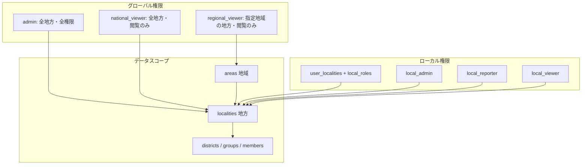

# 多地方運用対応プラン

## 用語の対応

| 要件の用語    | 実装での対応                                                                                       |
| -------- | -------------------------------------------------------------------------------------------- |
| 地方       | 既存の **locality**（調布・札幌など）。地方切り替え = locality 切り替え。                                            |
| 地域       | 新規 **area**（関東・関西など）。地域閲覧者はこの area に属する全 locality を閲覧可能。                                     |
| 地区・小組・名簿 | 既存の districts / groups / members。いずれも locality に紐づく（district → locality、member.locality_id）。 |

現状、localities は複数あるが **RLS で locality による行フィルタは行っておらず**、認証ユーザーは全 locality のデータを見られる状態。ここに「現在の地方」と「アクセス可能な地方」を導入する。

---

## 1. データ分離（地方間で記録が見えない）

**方針**: 地方 = **locality**。すべてのデータは既に locality に紐づく（district.locality_id、member.locality_id、meeting は district/locality 経由）。  
「現在選択中の locality」を **セッション（Cookie + コンテキスト）** で持ち、**アプリ層で全クエリをその locality に限定**する。

- **現在の地方の保持**: Cookie `current_locality_id` + React Context / サーバー用ヘルパーで「今の locality_id」を取得。地方切り替え時に Cookie 更新。
- **現在の地方が未設定のとき**（Cookie が空・初回訪問）: アクセス可能 locality が1つならその id を自動設定する。2つ以上なら、最初の1つをデフォルトにしつつヘッダーで切り替え可能にする（または選択を強制する）。未設定のまま一覧系に進まないようガードする。
- **クエリの絞り込み**:
  - localities: アクセス可能なものだけ一覧（後述の `user_localities` / グローバル権限で判定）。
  - districts / groups: `district.locality_id = current_locality_id`（または district_id IN (その locality の districts)）でフィルタ。
  - members: `locality_id = current_locality_id` でフィルタ。
  - meetings / attendance / regular lists 等: 既存の district_id / locality_id / member_id 経由で、上記で絞った id だけに限定（例: meeting は district_id がその locality のもののみ、member はその locality のもののみ）。
  - **locality に間接紐づくテーブル**も同様にスコープする: `member_local_enrollment_periods`, `attribute_histories`, `sunday_meeting_modes`, `organic_dispatch_records` は、district_id / group_id / member_id が「その locality の districts / groups / members に含まれる」場合のみ対象にする（RLS とアプリの両方で一貫させる）。
- **RLS（防御の二重化）**: 「このユーザーがアクセス可能な locality に属する行だけ見える」ようにする。  
  - 新規ヘルパー: `get_my_accessible_locality_ids()`（後述の権限テーブルから返す）。  
  - 各テーブルで、locality に紐づく列（locality_id または district → locality）が `get_my_accessible_locality_ids()` に含まれる場合のみ SELECT/INSERT/UPDATE/DELETE を許可。  
  - これにより、アプリのミスで current_locality を付け忘れても、他地方のデータは返らない。

**影響箇所（抜粋）**:  
`src/lib/cachedData.ts`（getMeetingsLayoutData, getCachedLocalities）、`src/app/(dashboard)/members/page.tsx`、`src/app/api/members/route.ts`、`src/app/api/organization-lists/route.ts`、`src/app/(dashboard)/charts/page.tsx`、集会・出欠・名簿・設定の各ページ・actions、`src/app/api/data-version/route.ts`（current_locality でスコープするか、global な更新日時のみ返すか方針を決める）。  
一貫して「current_locality_id をどこで渡すか」「各クエリにどう付与するか」のパターンを決め、全データ取得をそのパターンに合わせる。実装・レビュー時は**影響箇所チェックリスト**を使い、current_locality フィルタの付け忘れを防ぐ。

---

## 2. アカウントごとにアクセス可能な地方を付与

**新規テーブル**:

- **user_localities**  
  - `user_id` (auth.users), `locality_id` (localities), UNIQUE(user_id, locality_id).  
  - このユーザーが「切り替え可能な地方」の一覧。ここに含まれる locality だけが地方切り替えの候補になり、その地方を選択したときだけデータが見える・操作できる（権限は次節に従う）。

**ルール**:

- **グローバル権限あり**（admin / national_viewer / regional_viewer）:  
  - admin / national_viewer: `user_localities` に登録がなくても「全 locality にアクセス可能」とみなす（切り替え一覧は全 localities、または地域で絞った localities）。  
  - regional_viewer: アクセス可能 locality = 指定された地域(area)に属する localities（後述の `user_areas` で判定）。
- **グローバル権限なし**（ローカルのみ）:  
  - アクセス可能 locality = `user_localities` に含まれるものだけ。ここに無い地方は切り替え候補にも出さず、データも見せない。

**UI**: ヘッダーまたは設定付近に「地方切り替え」ドロップダウンを追加。選択肢は上記「アクセス可能な localities」のみ。選択時に `current_locality_id` を Cookie に保存し、以降の表示・API はすべてその locality にスコープする。

---

## 2.5 ロール管理ページ（Supabase に入らずアプリ内で完結）

**目的**: 運用者が Supabase ダッシュボードに触れず、アプリ内だけでユーザーの追加・グローバル/ローカル権限の付与・変更を行えるようにする。

**誰が使えるか**:
- **global_role = admin** のユーザーのみアクセス可能（例: 設定 > ユーザー・ロール管理）。全ユーザーの global_role / user_areas / user_localities / local_roles を編集できる。
- 必要に応じて **local_admin** に「自分が local_admin である地方についてだけ、その地方の local_roles（local_reporter / local_viewer の付与・変更）と user_localities の追加」を許可するかはポリシーで決める。その場合、ユーザー新規追加や global_role の変更は global admin のみ。

**できること（アプリ内で完結）**:

| 操作 | 内容 |
|------|------|
| **ユーザー追加** | メールアドレスを入力して「招待」を送信。Supabase Auth の **Invite by email**（管理 API）を Server Action から呼び、招待メール送信と同時に profiles にレコードを作成し、必要なら `user_localities` / `local_roles` を初期登録する。招待されたユーザーが初回ログインすると、付与済みの権限で利用開始できる。 |
| **グローバル権限の付与・変更** | profiles の `global_role` を変更（admin / national_viewer / regional_viewer / なし）。`global_role = regional_viewer` のときは、**user_areas** で「どの地域（area）を閲覧可能にするか」を複数選択して設定・変更する。 |
| **アクセス可能な地方の付与・変更** | **user_localities** の追加・削除。グローバル権限がないユーザーには、ここに登録した地方だけが切り替え候補になる。 |
| **ローカル権限の付与・変更** | ユーザー × 地方ごとに **local_roles**（local_admin / local_reporter / local_viewer）を設定・変更。user_localities に追加した地方ごとに、その地方での役割を選べるようにする。 |
| **報告者の編集可能地区** | 既存の **reporter_districts** を、そのユーザーが local_reporter である地方に限って編集可能にする（地方ごとに「編集できる地区」を選択）。 |

**実装の要点**:
- 招待には Supabase の **サービスロール**（または Admin API）が必要。Next.js の Server Action から `supabase.auth.admin.inviteUserByEmail()` を呼び、招待後に profiles / user_localities / local_roles を挿入する。
- 既存ユーザー一覧は profiles（＋必要なら auth.users の email）を RLS で「global admin のみ SELECT 可能」にして取得。編集は profiles.global_role の UPDATE、user_localities / user_areas / local_roles の INSERT/UPDATE/DELETE を、同じく global admin のみに許可する RLS で保護する。
- UI は既存の「ユーザー管理」（設定内）を拡張するか、**設定 > ユーザー・ロール管理** のような専用ページにし、一覧 → 選択 → グローバル権限・地域・地方・ローカル役割を一画面で編集できるフォームにする。

これにより、**Supabase のダッシュボードにログインしなくても、ユーザー追加とグローバル/ローカル権限の付与・変更をすべてアプリ内で行える**。

---

**役割の一覧（混乱防止のため名前を分離）**

| 種別    | 値                   | 意味                    |
| ----- | ------------------- | --------------------- |
| グローバル | **admin**           | 全地方で全権限               |
| グローバル | **national_viewer** | 全地方で閲覧のみ              |
| グローバル | **regional_viewer** | 指定地域の地方で閲覧のみ          |
| ローカル  | **local_admin**     | その地方の管理者（設定・ユーザー権限含む） |
| ローカル  | **local_reporter**  | その地方の報告者（出欠・名簿の編集）    |
| ローカル  | **local_viewer**    | その地方の閲覧のみ             |

**3.1 グローバル権限（profiles 拡張）**

- **profiles** に `global_role` を追加:  
  - `enum: 'admin' | 'national_viewer' | 'regional_viewer' | null`  
  - `null` = グローバル権限なし（ローカルのみ）。
- 既存の `role` は「グローバル権限がない場合のデフォルト表示用」または「単一地方運用時の後方互換」として残すか、段階的に `local_roles` に寄せる（後述）。

**意味**:

- **admin**: 全地方に対して全権限（現在の admin と同等。RLS も「全 locality アクセス可」）。
- **national_viewer**: 全地方の**閲覧のみ**。切り替えで全 locality を選べるが、書き込みは不可（report 系は local 権限に依存）。
- **regional_viewer**: **特定地域（area）**に属する地方のみ閲覧。どの地域を見れるかは `user_areas` で管理。

**3.2 地域（area）の導入**

- **areas** テーブル: `id`, `name`（例: 関東, 関西）。  
- **localities** に `area_id` (NULLable, FK → areas)。既存データは NULL のままでも可。  
- **user_areas**: `user_id`, `area_id`, UNIQUE(user_id, area_id)。  
  - `global_role = 'regional_viewer'` のユーザーが閲覧できる locality = `locality.area_id IN (user_areas.area_id)`。

**3.3 ローカル権限（地方ごとの役割）**

- **local_roles** テーブル:  
  - `user_id`, `locality_id`, `role` (enum: **local_admin** | **local_reporter** | **local_viewer**), UNIQUE(user_id, locality_id).  
  - 「その地方ではこの役割」を表現。グローバルと区別するためローカル側は `local_` 接頭辞で統一。
- **有効な権限の決め方（優先順位）**:
  1. `global_role = 'admin'` → 全地方で全権限。
  2. `global_role = 'national_viewer'` → 全地方で閲覧のみ。
  3. `global_role = 'regional_viewer'` かつ 現在の locality が `user_areas` のいずれかの area に属する → その地方で閲覧のみ。
  4. 上記以外 → 現在の locality について `local_roles` の `role` を使う（**local_admin** / **local_reporter** / **local_viewer**）。**`local_roles` に無い場合は「アクセス不可」とする**（推奨: `profiles.role` フォールバックは廃止し、意図しない他地方アクセスを防ぐ）。

**RLS の更新**:

- 既存の `get_my_role()` に代えて（または併用で）、  
  - `get_my_effective_role(locality_id)` のようなヘルパー: 上記 1–4 のルールで「その locality での effective role」を返す。
- `get_my_accessible_locality_ids()`: グローバル admin → 全 locality id、national_viewer → 全 locality id、regional_viewer → user_areas に含まれる area の localities、それ以外 → user_localities の locality_id 一覧。  
- 各テーブルの RLS は「行が属する locality が `get_my_accessible_locality_ids()` に含まれる AND（必要なら）effective role が権限条件を満たす」に変更。

**マイグレーション**:

- `areas` 作成、`localities.area_id` 追加、`user_localities` / `user_areas` / `local_roles` 作成、`profiles.global_role` 追加。  
- **ロール enum の整理**: グローバル用 `global_role_enum` = admin | national_viewer | regional_viewer。ローカル用 `local_role_enum` = **local_admin** | **local_reporter** | **local_viewer**（既存の co_admin は local_admin に統合するか、移行時に local_admin へマッピング）。
- 既存ユーザーは `global_role = 'admin'` に写す（現行の admin / co_admin 相当）。現行 reporter / viewer は、単一地方運用なら全 locality に対して `local_roles` に local_reporter / local_viewer を一括登録するか、`user_localities` + `local_roles` で移行。

---

## 4. 同一人物の管理者向け紐づけ

**要件**: 同じ人が別の地方に別メンバーとして登録されることは許容し、**データ上は別人**。管理者向けに「同一人物」として紐づけ表示するだけであり、各地方の名簿・出欠には影響しない。

**案**:

- **member_links** テーブル:  
  - `id`, `member_id_a`, `member_id_b`, `created_at`, `created_by_user_id`（任意）。  
  - 制約: `member_id_a` < `member_id_b`（一意性のため）、両方 FK → members。  
  - 「この2つの member は同一人物と管理者がマークした」という関係のみを保持。
- **運用**: 管理者専用画面（例: `/settings/identity-links` や `/debug/member-links`）で、2人の member を選択して「同一人物として紐づけ」を実行。紐づけは表示専用（集計や名簿には使わない）。  
- **表示**: メンバー詳細や管理者向け一覧で「他地方の同一人物: 調布 山田太郎」のように、`member_links` をたどって表示する。  
- **RLS**: `member_links` の SELECT/INSERT/DELETE は、**link に含まれるいずれかの member が属する locality において、そのユーザーが local_admin（または global_role = 'admin'）である場合に許可**する。つまり「両方の locality で local_admin である必要はなく、どちらか一方で local_admin なら可」とする。

**地方に影響を及ぼさない**: 名簿・出欠・集会はすべて既存の `members` のまま。`member_links` は参照用のみで、既存クエリには一切 join しない。

---

## 5. 実装の流れ（推奨順）

1. **DB スキーマ**
   - areas, localities.area_id, user_localities, user_areas, local_roles, profiles.global_role, member_links のマイグレーション。  
   - 既存データ・既存ユーザーの移行（global_role の設定、必要なら local_roles の初期データ）。
2. **RLS の書き換え**
   - get_my_accessible_locality_ids(), get_my_effective_role(locality_id) を追加し、localities / districts / groups / members / meetings / attendance / regular lists 等のポリシーを「アクセス可能 locality + effective role」ベースに変更。
3. **アプリ層の「現在の地方」**
   - Cookie + コンテキストで current_locality_id を保持。  
   - 地方切り替え UI を追加。  
   - getCachedLocalities / getMeetingsLayoutData 等を「アクセス可能 localities」「現在の locality」を考慮するように変更。
4. **全データ取得の locality スコープ**
   - 上記の一覧に従い、members, districts, groups, meetings, attendance, organization-lists, dashboard, settings/organization 等、すべての読み書きで current_locality_id でフィルタするよう変更。  
   - API ルート・Server Actions でも同様に current_locality_id を渡し、他地方の id が渡ってきたら 403 とする。
5. **同一人物紐づけ**
   - member_links 用の管理者画面と、メンバー詳細での「他地方の同一人物」表示を実装。
6. **ロール管理ページ**
   - 設定内に「ユーザー・ロール管理」を追加。招待（メール）、global_role / user_areas / user_localities / local_roles の編集、reporter_districts の編集をアプリ内で完結させる。RLS は global admin のみ profiles（他ユーザー）・user_localities・user_areas・local_roles の参照・更新を許可するようにする。
7. **テスト・ドキュメント**
   - 単一地方・複数地方・グローバル/地域/ローカル権限の組み合わせで、他地方のデータが見えないこと・正しい権限で操作できることを確認。  
   - リリースノートや運用ドキュメントに「地方」「地域」「グローバル/ローカル権限」「ロール管理ページ」の説明を追記。

---

## 6. 図解（権限とデータスコープ）

---

## 7. 注意点・確認事項

- **既存単一地方運用**: 既存ユーザーに global_role = 'admin'（または現行 role を global に写す）かつ current_locality_id を従来のその1 locality に固定すれば、現状に近い挙動にできる。  
- **reporter_districts と local_reporter**: 現行の「報告者が編集できる地区」は **現在選択中の locality 内**の district に限定して解釈する。**local_reporter も、その地方に限り reporter_districts で編集可能地区を制限する**（現行の報告者ロジックを locality 内にスコープする）。他地方の reporter_districts は無視する。  
- **main_district_id**: 地方ごとに「メインの地区」を持たせるか、現状どおり1つだけにするかは要件次第。複数地方対応時は「現在の地方内の main_district」として扱うのが自然。  
- **locality に紐づかないテーブル**: **profiles**, **system_settings**, **audit_logs**, **login_logs** は locality スコープ外とする。閲覧・編集は **global_role = 'admin' のみ**。local_admin にログの一部を見せる要件があれば別途追加する。  
- **バックアップ/リストア**（`BackupSection.tsx`）: **バックアップは「現在の locality のみ」を対象とする**。リストアは **global admin のみ**許可する（他地方データの上書きを防ぐ）。  
- **デバッグ画面**（`/debug/meeting-duplicates`, `/debug/numbers` 等）: **global admin のみアクセス**。対象データは全 locality。local_admin には見せない。  
- **api/data-version**: current_locality でスコープした「その地方のデータ更新日時」を返すか、global な更新日時のみ返すか方針を決める（実装時にどちらかで統一）。  
- **パフォーマンス**: get_my_accessible_locality_ids() は RLS で多用するため、SECURITY DEFINER で少ないクエリにまとめ、キャッシュ可能な形にする。必要に応じて Redis 等のキャッシュを検討する（まずは DB 内で完結でよい）。  
- **影響箇所チェックリスト**: データ取得・RLS の対象となるテーブル・API・ページの一覧を別 doc または本計画の付録として用意し、実装・レビューで「current_locality フィルタ済みか」を確認すると安全。

このプランに沿って実装すれば、DBは共通のまま「地方切り替えで地区・小組・名簿が全て異なる」「アカウントごとにアクセス可能な地方」「グローバル/ローカル権限の分離」「同一人物は管理者用の紐づけのみ」を満たせます。

---

## 8. 検証サマリ（第三者目線）

- 用語の対応・二重防御・役割名の分離・member_links の扱いは妥当。要件は計画でカバーされている。
- 上記セクション 1〜7 に、検証で挙がった「現在の地方未設定時」「member_links の RLS 解釈」「locality 外テーブル・Backup・reporter_districts と local_reporter」「影響テーブル一覧・チェックリスト」「profiles.role フォールバック廃止」を反映済み。実装・レビュー時はセクション 1 の影響箇所とセクション 7 のチェックリストを参照すること。
