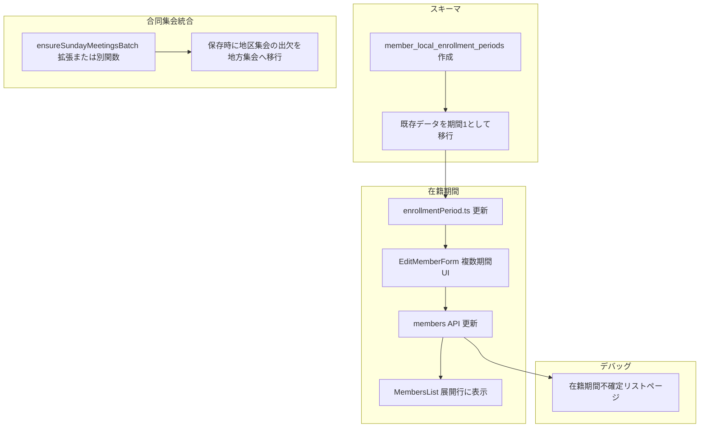

# Phase 6 実装計画

## 1. 合同集会の既存データ統合 (計画書 26)

**概要**: 保存時、地区別に複数集会がある場合、合同集会形式に統合する。

**現状**: 合同モードで保存する際、`ensureSundayMeetingsBatch` で地方集会を作成し、`attendanceMap` のレコードをその集会に保存している。地区集会に既存の出欠がある場合、それらは読み込まれず、統合もされない。

**実装方針**:

1. **保存時の前処理**（合同モード時）
   `src/app/(dashboard)/meetings/sunday/SundayAttendance.tsx` の保存ハンドラ内で、合同モードかつ地方集会が存在する場合に以下を実行:
   - 該当地方の地区集会（`district_id IN (地方の地区IDs)`, `event_date`, `meeting_type='main'`）を取得
   - 各地区集会の `attendance_records` を取得
   - `meeting_id` を地方集会 ID に更新（`meeting_id` を一括 UPDATE）
   - 同一 `member_id` の重複は、既存の `attendanceMap` を優先して上書きする形で扱う
   - 地方集会に統合し終えた地区集会の削除は Phase 6 では行わない（空の地区集会は残す）
2. **処理の流れ**
   - 単一地区・合同モード: その地方の地区集会を検索し、出欠を地方集会へ移行してから通常の保存処理
   - 全地区・合同モード: 各地域ごとに上記と同様の統合を行い、`ensureSundayMeetingsBatch` の結果に基づいて保存

---

## 2. 在籍期間の複数期間対応

### 2.1 スキーマ変更

**新規テーブル**: `member_local_enrollment_periods`

```sql
CREATE TABLE member_local_enrollment_periods (
  id UUID PRIMARY KEY DEFAULT uuid_generate_v4(),
  member_id UUID NOT NULL REFERENCES members(id) ON DELETE CASCADE,
  period_no INT NOT NULL,  -- 1, 2, 3...
  join_date DATE,
  leave_date DATE,
  is_uncertain BOOLEAN NOT NULL DEFAULT false,
  UNIQUE(member_id, period_no)
);
```

**移行**:

- `members` の `local_member_join_date`, `local_member_leave_date` は当面残す（後方互換）
- マイグレーションで、既存の `local_member_join_date` / `local_member_leave_date` が NULL でないメンバーを `member_local_enrollment_periods` の期間1として INSERT
- アプリ側では `member_local_enrollment_periods` を主データソースとし、`members` の列は参照しない（将来マイグレーションで削除可能）

### 2.2 在籍判定ロジックの更新

`src/lib/enrollmentPeriod.ts` の `isInEnrollmentPeriod` を拡張:

- 引数: `member` に加え、`enrollmentPeriods: { join_date, leave_date }[]` を渡す（または `member` に periods を含める）
- 任意の期間に対して `eventDate >= join_date` かつ `(leave_date IS NULL OR eventDate <= leave_date)` であれば在籍

**型**:

```ts
type EnrollmentPeriod = { join_date: string | null; leave_date: string | null };
type MemberWithPeriods = { 
  enrollment_periods?: EnrollmentPeriod[] | null;
  // 互換: local_member_join_date, local_member_leave_date も許容
};
```

### 2.3 名簿編集フォームの変更

`src/app/(dashboard)/members/[id]/edit/EditMemberForm.tsx`:

- 期間を `member_local_enrollment_periods` から取得して表示（期間1, 期間2, …）
- 各期間に「ローカルメンバー転入日」「ローカルメンバー転出日」「期間不確定」トグルを表示
- 「ローカル在籍期間を追加する」ボタンを追加し、クリックで新規期間を追加
- 保存時に `member_local_enrollment_periods` を UPSERT（`member_id`, `period_no` で一意）

### 2.4 API・データ取得の更新

- `src/app/api/members/route.ts`: `member_local_enrollment_periods` を JOIN して返す（または別エンドポイントで取得）
- `src/app/(dashboard)/members/[id]/edit/page.tsx`: 期間データを取得して `EditMemberForm` に渡す
- `src/app/(dashboard)/members/[id]/edit/actions.ts`: 期間の UPSERT を実装

---

## 3. デバッグ「在籍期間不確定リスト」

**新規ページ**: `/debug/enrollment-uncertain`

- 管理者専用（既存の `src/app/(dashboard)/debug/layout.tsx` を利用）
- 表示を2グループに分ける:
  - **グループ A**: 期間1の転入日が NULL のメンバー
  - **グループ B**: いずれかの期間で `is_uncertain = true` のメンバー
- 同一メンバーが両方に該当する場合は両方に表示
- 各行で編集リンク（`/members/[id]/edit`）を表示し、期間を編集できるようにする

---

## 4. 名簿管理アコーディオン内の表示

`src/app/(dashboard)/members/MembersList.tsx` の展開行（`expandedId`）:

- `members` に `local_member_join_date`, `local_member_leave_date` または `enrollment_periods` を含める
- 展開時に以下を表示:
  - **ローカルメンバー転入日**: 期間1の転入日（複数期間なら「期間1: YYYY-MM-DD」「期間2: YYYY-MM-DD」など）
  - **ローカルメンバー転出日**: 値がある場合のみ表示、NULL なら非表示

`src/app/api/members/route.ts` の SELECT に `local_member_join_date`, `local_member_leave_date` を追加し、将来的に `member_local_enrollment_periods` を JOIN して複数期間を渡す。

---

## 5. 実装順序



---

## 6. 影響範囲まとめ

| 対象 | 変更内容 |
|------|----------|
| `supabase/migrations/021_*.sql` | `member_local_enrollment_periods` 作成、既存データ移行 |
| `enrollmentPeriod.ts` | 複数期間対応 |
| `EditMemberForm.tsx`, `edit/actions.ts`, `edit/page.tsx` | 複数期間の編集・保存 |
| `api/members/route.ts` | 期間データの取得 |
| `MembersList.tsx` | 展開行に在籍期間表示 |
| `SundayAttendance.tsx`, `actions.ts` | 保存時の既存データ統合 |
| `debug/enrollment-uncertain/` | 新規ページ |
| `SundayAttendance`, `PrayerMeetingAttendance`, `SmallGroupAttendance` | メンバー取得に `enrollment_periods` を含める |

---

## 7. 確認事項

- **地区集会の削除**: 統合後に空になった地区集会を削除するか、残すか。計画書には明記がないため、初回は残す方針を推奨。
- **期間の重複**: 同じメンバーが複数期間で重複する日付を持つ場合の扱い（例: 期間1の転出日と期間2の転入日が重なる）は、仕様として許容するか要確認。
